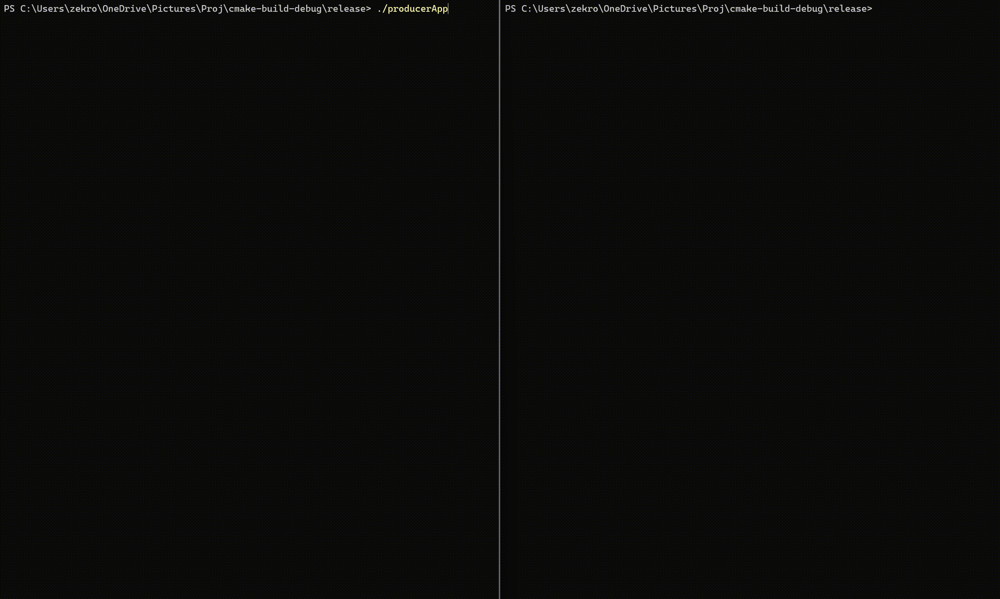

## High-Performance C++ Order Matching Engine (LOB)

#### An ultra-low-latency, lock-free limit order book designed for high throughput financial systems. <br> This engine utilizes Fixed-Point Arithmetic and Shared Memory IPC to process market data at very high speeds.

### Performance Benchmarks

    - Throughput: 24.85 million orders/sec
    - Average Latency: 40.24 ns/order
    - Dataset: 112M+ real-world tick records (Kibot)
    - Environment: Windows 11



### Hardware Specs 

    Asus ROG Strix (2024)

    CPU: Intel® Core™ i9-14900HX (24 Cores / 32 Threads)
    Memory: 16GB DDR5 @ 5600 MT/s

    Cache Hierarchy:
        L1 Cache: 80 KB per core (Instruction + Data)
        L2 Cache: 2 MB per core
        L3 Cache (Shared): 36 MB Intel® Smart Cache

### Key Features

    - Lock-Free IPC: A ring-buffer over Windows Shared Memory using std::atmoic
    - Fixed-Point Math: Representing prices in tenths of a cent, ensuring 100% precision for matching logic
    - Cache Optimization: Structured data to minimize false sharing with alignas(64)
    - Windows Section Objects: Leveraged CreateFileMapping and MapViewOfFile for low-overhead kernel-level memory sharing, achieving sub-50ns process-to-process signaling

### Execution Flow

    1. Producer Initialization: The producerApp maps the shared memory segments and pre-loads data into a local cache
    2. Buffer Pre-fill: The producer fills the initial 4096-slot buffer and signals "Ready for Matching"
    3. Consumer Lifecycle: The consumerApp attaches to the segment and begins processing
    4. Real-time Metrics: The consumer provides a live report every second, calculating M/s throughput

### Run it locally

This project is build for a Windows10/11 machine and requires a C++20 compatible compiler

Note:
Due to github's file storage limits, the orginal dataset used for the runs that produced the above benchmarks could not be uploaded here. It is over 500MB. <br>
A small dataset has been added which conatins the first 10k entries of that dataset. The producer is built to recycle the orders and hit 150 million orders, which will still give you the above results.<br>
The full dataset can be downloaded from https://www.kibot.com/free_historical_data.aspx <br>
The "Tick with bid/ask data" is the dataset used. <br>
You can add it to data/historical/ and change the filename in producerMain.cpp to that


1. From the project root, use the following commands to generate and build the release executables <br>
    ```bash 
   mkdir build 
   cd build 
   cmake .. -DCMAKE_BUILD_TIME=Release 
   cmake --build . --config Release 
   ```
2. Running the benchmark <br>
    The build process generates two separate executables in the build/release/Release directory
    Open two terminals
3. Terminal A <br>
    Run the producer
    ```bash
    ./producerApp.exe
   ```
   Wait for the message: [STATUS] Shared Memory Initialized. Ready for Matching.  
4. Terminal B <br>
    Once the producerApp displays the ready status, run the consumerApp on terminal B
    ```bash
    ./consumerApp.exe
   ```

The consumer will attach to the shared memory and begin the 100M+ order matching cycle
The number of orders can be controlled in producerMain.cpp
